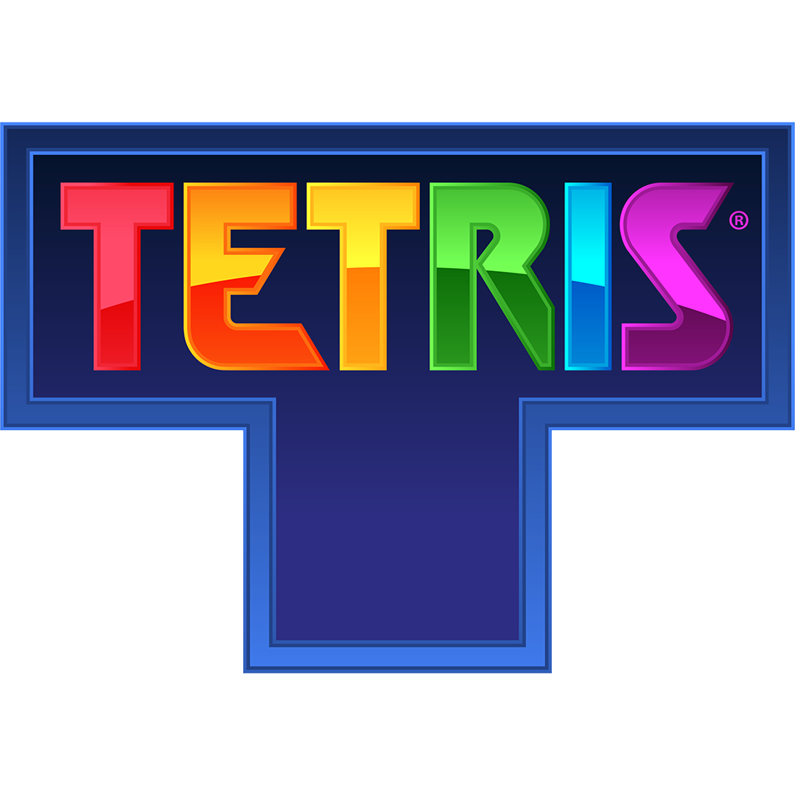
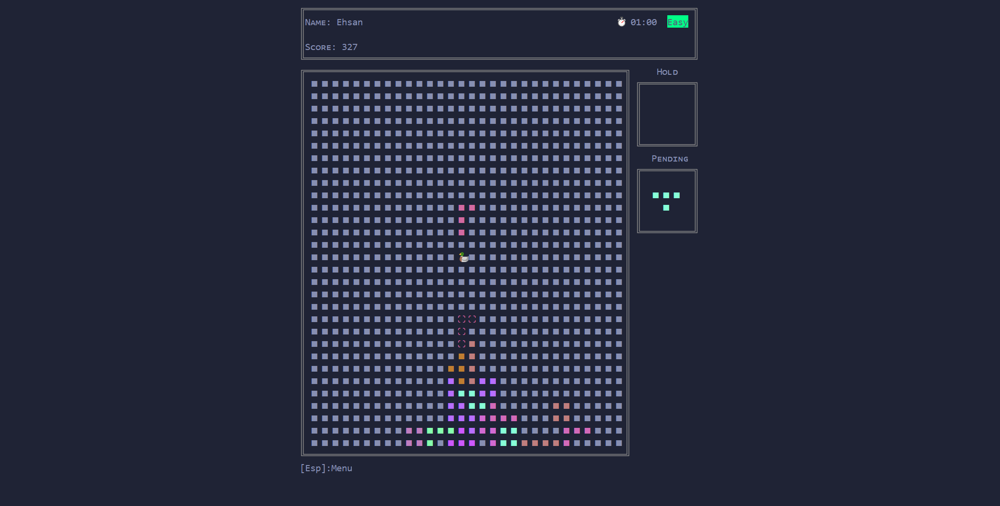
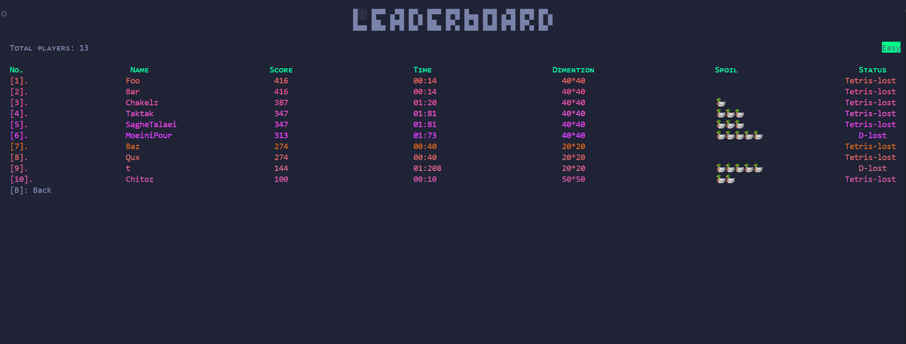

# Tetris (Unicode terminal game)
  

 

A C++ implementation of the classic Tetris game, built from the ground up with enhancements and additional features. This project stays true to the original while introducing fresh elements to make it remain nostalgic.

## Quick guide
### Compile with:
 `c++ *.cpp -lwinmm`
## Features
- In-Game Sound Effects 🔊
- Responsive UI💅: press any key to update the view
- Resumability: Save your progress and continue later! The current map, held Tetromino, and pending Tetrominos are all restored.
All the current map held and pendding tetrominos are retured
- Hold Feature: Store a Tetromino for later use during gameplay.
- See incoming Tetromino
- Easter Egg 🦆: A spoiler duck randomly spawns on the map. Each hit spoils the current Tetromino, and hitting 5 ducks results in a loss (D-lost!).
- 3 levels (Speed scales with the level/ Hard mode disables the shadow guide for added difficulty)
- Mid-game Pause Menu
- Timer
- leaderboard: Separate leaderboards for each level, sorted by score and time.
- Dynamic dimentions

## Shortcuts

| Key | Action |
| ---- | ----- |
| `🠨` `🠪` `🠫` | Move Tetromino |
| `🠩` | Rotate |
| `Esc` | Pause |
| `H` | Hold |
| `Space` | Push down |

## Contributing
We warmly welcome and value your contributions to this project!🧸

If you have ideas for enhancements, bug fixes, or new features, feel free to fork the repository, make your changes, and submit a pull request. Your input helps make this project better for everyone.

Don’t forget to star🌟 the repository if you find it useful! Thank you for your support!
## Acknowledgments

* [Tetris Game](https://en.wikipedia.org/wiki/Tetris)
* [Gravity Guy sound](https://www.miniplay.com/game/gravity-guy) (All the in-game and menu sounds)
